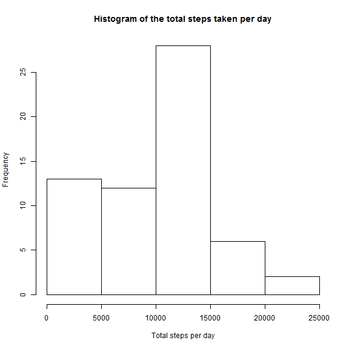
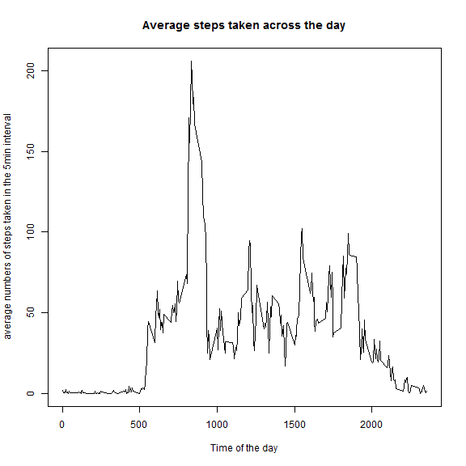
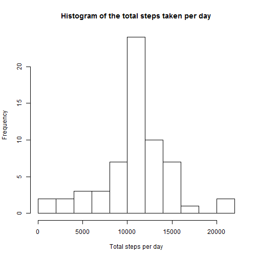
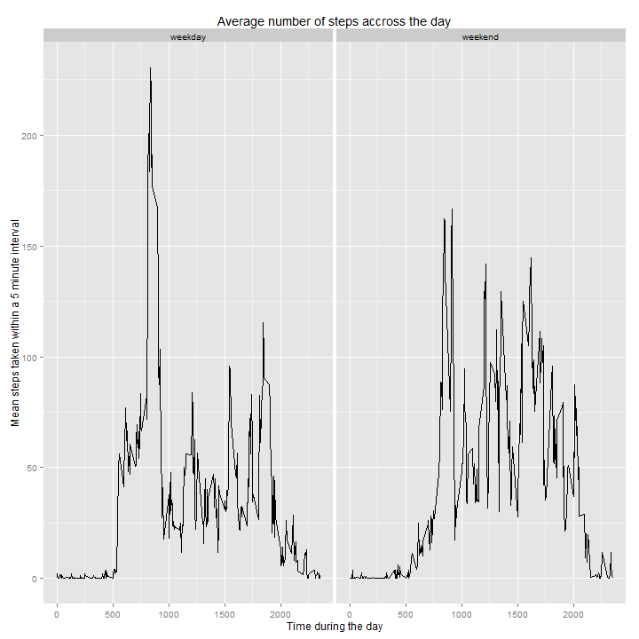

# Reproducible Research Assignment 1

### Jakub Czakon

# Loading and preprocessing the data

We will start by loading into R the human activity data.


```r
activity<-read.csv("activity.csv")
activity$date<-as.Date(activity$date)

interval_convert<-function(interval){
  k<-nchar(as.character(interval))
  
  if(k==1){
    time<-paste("00:0",as.character(interval),sep="")
  }else if(k==2){
    time<-paste("00:",as.character(interval),sep="")
  }else if(k==3){
    time<-paste("0",substr(as.character(interval),1,1),":",substr(as.character(interval),2,3),sep="")
  }else if(k==4){
     time<-paste(substr(as.character(interval),1,2),":",substr(as.character(interval),3,4),sep="")
  }
  time
}
```

# What is mean total number of steps taken per day?

We will now use package dplyr to group the data by day.


```r
library(dplyr)
activity_grouped<-group_by(activity,date)
activity_by_day<-summarise(activity_grouped,total_steps=sum(steps,na.rm=T))
```

We will now construct a histogram of the total steps taken each day:


```r
hist(activity_by_day$total_steps,
     main="Histogram of the total steps taken per day",
     xlab="Total steps per day",breaks="FD")
```

 

We will now calculate the mean and median of the data:


```r
activity_mean<-mean(activity_by_day$total_steps)
activity_median<-median(activity_by_day$total_steps)
```

**Mean** was 9354 steps and the **median** was 1.0395 &times; 10<sup>4</sup>steps.

# What is the average daily activity pattern?


```r
activity_gr_interval<-group_by(activity,interval)
activity_by_interval<-summarise(activity_gr_interval,mean_steps=mean(steps,na.rm=T))

plot(activity_by_interval$interval,activity_by_interval$mean_steps,
     type="l",
     main="Average steps taken across the day",
     xlab="Time of the day",
     ylab="average numbers of steps taken in the 5min interval")
```

 


```r
activity_max<-max(activity_by_interval$mean_steps)
interval_max<-activity_by_interval[activity_by_interval$mean_steps==activity_max,]$interval
```
The interval where on average the most steps are taken is in fact the interval of time starting at **08:35**

# Imputing missing values

We will first calculate the number of missing values in the dataset:


```r
missing_values<-sum(is.na(activity$steps))
missing_values
```

```
## [1] 2304
```

Now we will impute missing values as the **average mean for the corresponding interval**, creating a new data set:


```r
activity_clean<-activity
n<-length(activity$steps)

for(i in 1:n){
  if(is.na(activity[i,1])){
    
    activity_clean[i,1]<-activity_by_interval[activity_by_interval$interval==activity[i,3],2]
  }
  
}
```


```r
activity_clean_grouped<-group_by(activity_clean,date)
activity_clean_by_day<-summarise(activity_clean_grouped,total_steps=sum(steps,na.rm=T))
```

And now we will produce a histogram and calculate mean and median for the new clean data


```r
hist(activity_clean_by_day$total_steps,
     main="Histogram of the total steps taken per day",
     xlab="Total steps per day",
     breaks="FD")
```

 


```r
activity_clean_mean<-mean(activity_clean_by_day$total_steps)
activity_clean_median<-median(activity_clean_by_day$total_steps)
```

**Mean** was 1.0766 &times; 10<sup>4</sup>steps and the **median** was 1.0766 &times; 10<sup>4</sup>steps. The values calculated here differ in that the median is way closer to the mean than before. That is because we were imputing the corresponding mean which would obviously make the data more centered and symetrical.

# Are there differences in activity patterns between weekdays and weekends?

We will first plot the daily activity patterns for weekdays and weekends on two separate panels. We will do that by using the following code:


```r
activity_clean<-mutate(activity_clean,weekday=weekdays(as.Date(date)))%>%
mutate(weekend=ifelse(weekday=="sobota" | weekday=="niedziela","weekend","weekday"))%>%
select(steps,date,interval,weekend)

activity_clean_gr_interval<-group_by(activity_clean,interval,weekend)
activity_clean_by_interval<-summarise(activity_clean_gr_interval,mean_steps=mean(steps,na.rm=T))

library(ggplot2)
ggplot(data=activity_clean_by_interval,
       aes(x=interval,y=mean_steps))+
          geom_line()+
          facet_wrap(~weekend)+
          labs(x="Time during the day",
               y="Mean steps taken within a 5 minute interval",
               title="Average number of steps accross the day")
```

 

As it turns out there is a very big difference between those 2 plots. It turns out that during the weekdays there is way more activity around **08:35** which is quity obvious since people need to get to work right about that time.
